# Test Report - InPost QA Assignment

**Tester:** Mateusz Gałuszka  
**Date:** 2026-05-05  
**Environment:** http://localhost:3000 (Next.js 15, Node.js)  
**Browser:** Chromium 1280×800  

---

## Strona główna (/)

**[Medium]** Pasek nawigacyjny (navbar) niepoprawnie wyświetla się na ekranach średnich (768px–1023px)  
Opis: Przy szerokości okna w zakresie breakpointu `md` (np. na tabletach), elementy nawigacyjne w górnym menu (linki, przyciski) nie mają wystarczająco dużo miejsca. Powoduje to, że nachodzą na siebie lub łamią układ, tworząc nieestetyczny i trudny w obsłudze interfejs. Zamiast płynnego responsywnego zachowania, menu po prostu się kurczy.  
Odtwarzanie: Wejdź na stronę główną i ustaw szerokość okna na np. 850px.  
Oczekiwany wynik: Menu powinno się zwinąć do "hamburger menu" (jak na ekranach mobilnych) lub marginesy powinny być odpowiednio pomniejszone.  

**[High]** Wyszukiwarka lokalizacji (postcode) zawsze zwraca błąd 500  
Opis: Każde zapytanie do `/api/postcode` zwraca HTTP 500 z komunikatem „Service temporarily unavailable. Please try again later." Endpoint jest niezaimplementowany - handler zwraca stały błąd bez logiki. Użytkownik nie może znaleźć żadnego lockera.  
Odtwarzanie: Wpisz dowolny kod pocztowy (np. `SW1A 1AA`) → kliknij przycisk strzałki → pojawia się komunikat błędu.  
Oczekiwany wynik: Lista lokalizacji InPost w pobliżu podanego kodu pocztowego.  
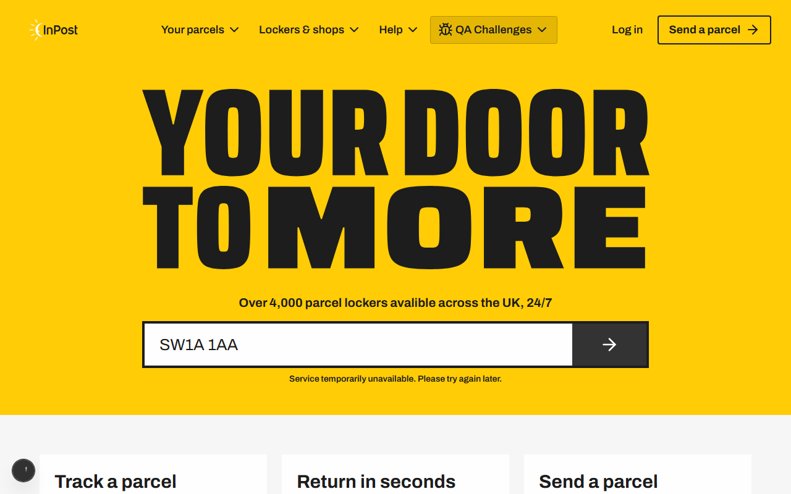

**[Medium]** Typo w sekcji hero: „avalible" zamiast „available"  
Opis: Tekst pod grafiką główną zawiera literówkę: „Over 4,000 parcel lockers **avalible** across the UK, 24/7". Błąd ortograficzny wpływa na wizerunek marki.  
Oczekiwany wynik: „Over 4,000 parcel lockers **available** across the UK, 24/7"  
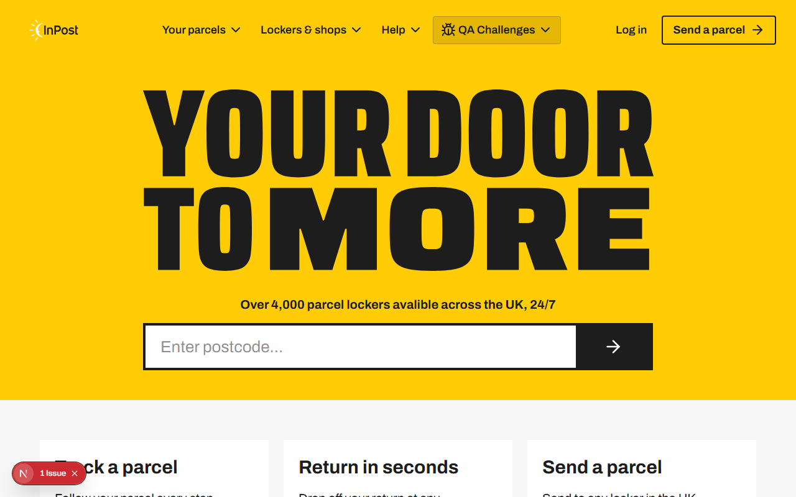

**[Medium]** Karty CTA („Track a parcel", „Return in seconds", „Send a parcel") nie są klikalne  
Opis: Trzy karty mają klasę `cursor-pointer` i wyglądają jak interaktywne elementy, ale nie są ani linkami (`<a>`), ani przyciskami (`<button>`). Kliknięcie nie wywołuje żadnej akcji. Użytkownik może być zdezorientowany.  
Oczekiwany wynik: Karty prowadzą do odpowiednich sekcji lub stron (np. śledzenie paczki, zwroty, wysyłka).  
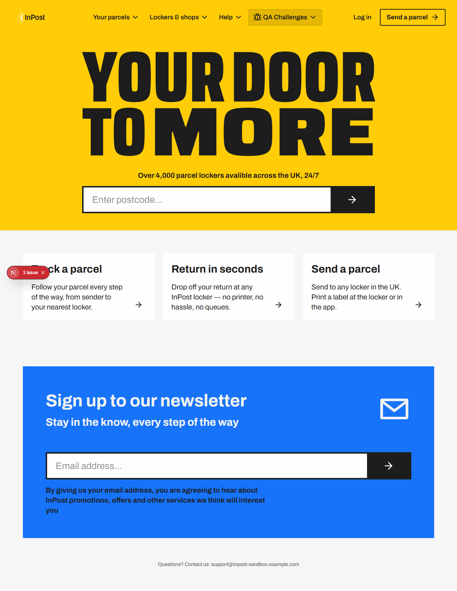

**[Medium]** Newsletter: niepełna walidacja pola email przepuszcza błędne adresy  
Opis: Pole email ma `type="text"` zamiast `type="email"` i brak atrybutu `required`. Dodatkowo walidacja JS jest zbyt słaba - akceptuje częściowe adresy jak `a@b` (brak domeny z kropką) i wyświetla komunikat sukcesu mimo niefunkcjonalnego adresu.  
Oczekiwany wynik: Zmiana na `type="email"` z atrybutem `required` oraz wdrożenie ścisłego regexa lub biblioteki walidującej pełny format emaila po stronie JS.  
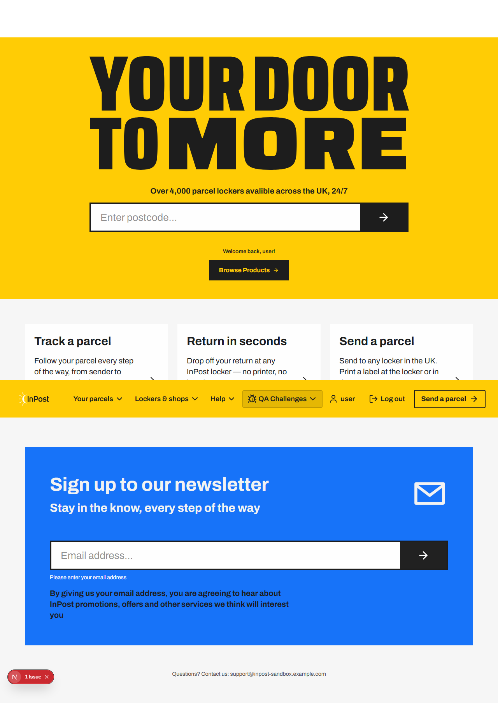  
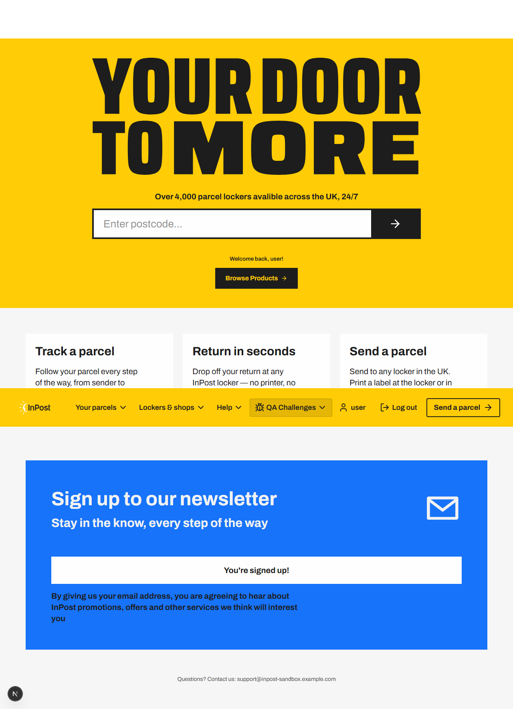

---

## Strona logowania (/login)

**[Critical]** Formularz logowania niewidoczny na ekranach średnich (768px–1023px)  
Opis: Kontener formularza ma klasy Tailwind `md:hidden lg:flex`, co ukrywa go w zakresie breakpointów md (768–1023px), czyli m.in. na tabletach i mniejszych laptopach. Strona wyświetla się jako biała i pusta - użytkownik nie może się zalogować.  
Odtwarzanie: Otwórz `/login` przy szerokości okna 900px.  
Oczekiwany wynik: Formularz widoczny na wszystkich rozmiarach ekranu.  

**[High]** Serwer zwraca HTTP 500 przy niepoprawnym formacie emaila  
Opis: Endpoint `/api/login` rzuca wyjątek (`throw new Error('Invalid email format')`) zamiast zwracać odpowiedź 400. Next.js przechwytuje niezłapany wyjątek i odpowiada błędem 500. Klient otrzymuje odpowiedź inną niż oczekiwana, co może skutkować błędem w UI.  
Odtwarzanie: `POST /api/login` z body `{ "email": "notanemail", "password": "anything" }`  
Oczekiwany wynik: HTTP 400 z JSON `{ "error": "Invalid email format" }`.  

**[Medium]** Link „Sign up here" to nieklikalny ``, nie link  
Opis: Tekst „Sign up here" pod formularzem jest renderowany jako ``, nie `<a>`. Kliknięcie nie powoduje żadnej akcji. Użytkownik może oczekiwać nawigacji do rejestracji.  
Oczekiwany wynik: `<a href="/register">Sign up here</a>` lub przycisk z obsługą nawigacji.  
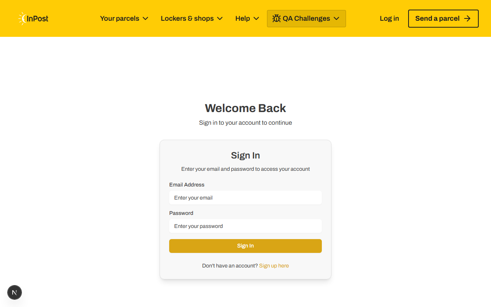

**[Low]** Walidacja email w yup nie sprawdza formatu  
Opis: Schema yup: `email: yup.string().required('Email is required')` - brak `.email()` walidatora. Wartości jak `notanemail` lub `a b` przejdą walidację po stronie klienta.  
Oczekiwany wynik: `email: yup.string().email('Enter a valid email').required('Email is required')`  
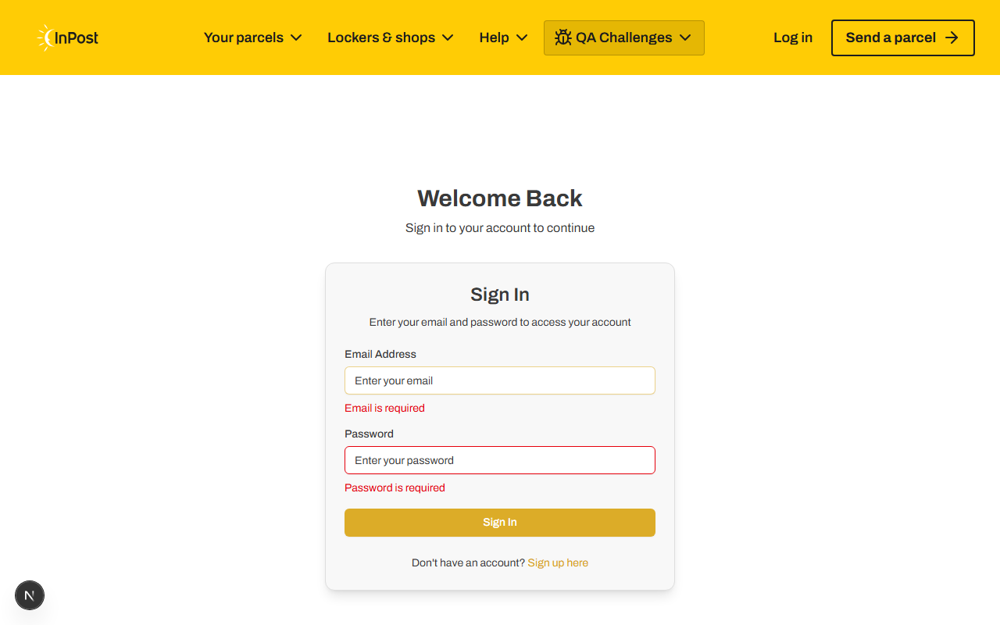

**[Low]** Zbyt ogólny komunikat błędu po nieudanym logowaniu  
Opis: Po błędzie HTTP 401 (złe dane) UI wyświetla „Login failed. Please try again." - komunikat jest taki sam jak przy błędzie sieciowym. Brak informacji czy problem dotyczy emaila, hasła, czy połączenia.  
Oczekiwany wynik: „Invalid email or password. Please try again."  
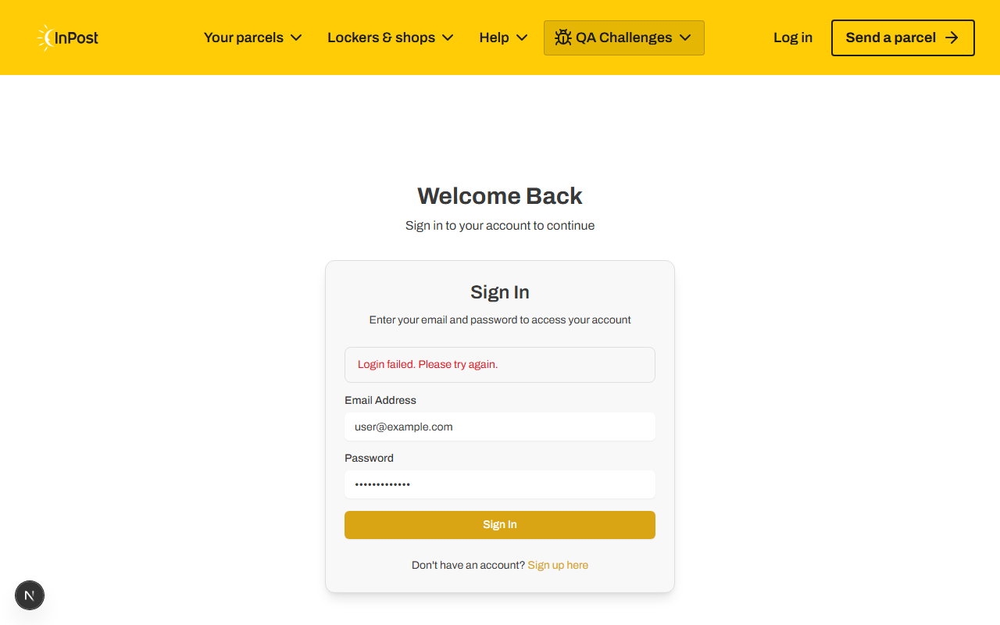

---

## Strona profilu (/profile)

**[High]** Niezalogowany użytkownik widzi pustą stronę zamiast przekierowania  
Opis: Komponent `ProfilePage` zwraca `null` gdy `!user`, co powoduje renderowanie pustej białej strony. Brak przekierowania do `/login`. Użytkownik nie wie dlaczego strona jest pusta.  
Odtwarzanie: Wejdź na `http://localhost:3000/profile` bez wcześniejszego logowania.  
Oczekiwany wynik: Przekierowanie `router.push('/login')` z opcjonalnym parametrem `?redirect=/profile`.  
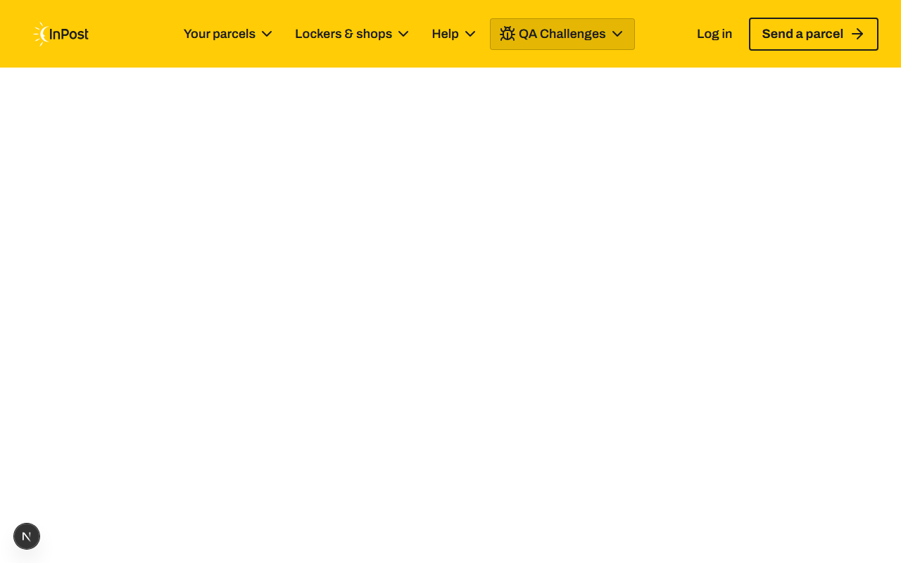

**[High]** Pole „Member Since" wyświetla „Invalid Date"  
Opis: Kod `new Date('asdasd').toString()` w `profile/page.tsx` (linia 88) produkuje string „Invalid Date". Jest to hardcoded błąd - zmienna `user.id` jest ustawiana jako `Date.now().toString()` przy logowaniu, ale funkcja `Number.parseInt(user.id)` jest już poprawna i zwróci timestamp. Jednak linia 88 ignoruje `joinDate` i zamiast tego ewaluuje statyczną wartość.  
Odtwarzanie: Zaloguj się, wejdź na `/profile` → sekcja „Member Since" pokazuje „Invalid Date".  
Oczekiwany wynik: Sekcja „Member Since" powinna używać zmiennej `joinDate` (zdefiniowanej na linii 27) zamiast `new Date('asdasd').toString()`.  

**[Medium]** Nazwa użytkownika oparta na prefiksie emaila (bez kapitalizacji właściwej)  
Opis: Użytkownik `user@example.com` widzi imię `user` (przed `@`). Klasa CSS `capitalize` jedynie kapitalizuje pierwszą literę, ale użytkownicy z emailami jak `jan.kowalski@...` zobaczą `jan.kowalski` jako imię. To nie jest prawdziwe imię.  
Oczekiwany wynik: Formularz rejestracji/logowania powinien zawierać pole na imię i nazwisko. Lub `user.name` powinien być ustawiony na wartość „Unknown User" jeśli nie ma prawdziwego imienia.  
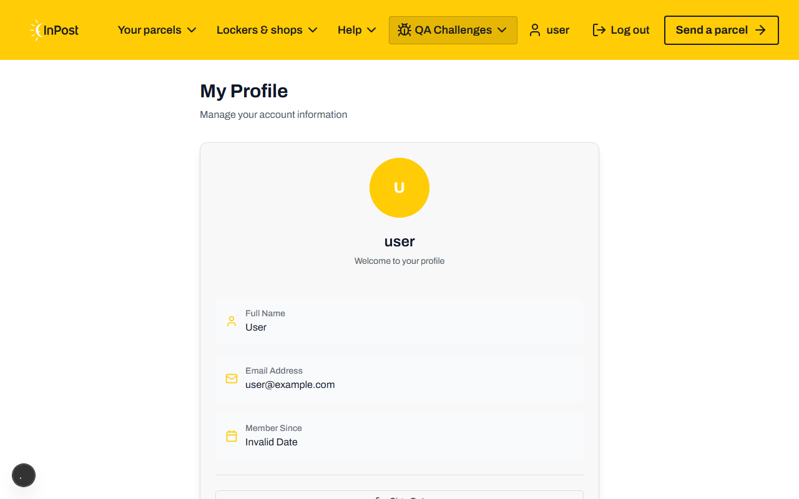

---

## Znalezione poza stronami testowanymi

Poniższe błędy zostały znalezione podczas eksploracji aplikacji poza głównymi stronami (/ , /login , /profile).

## Strona async (/challenges/async)

**[Low]** Pole parcel number nie ma przycisku czyszczenia i brak walidacji przy pustym polu  
Opis: Wysłanie pustego pola parcel number powoduje zapytanie do API z `parcelNumber: ""` - API zwraca 400. Brak walidacji po stronie frontendu.  
Oczekiwany wynik: Walidacja pola przed wysłaniem - komunikat „Please enter a parcel number".  

---

## Strona visual (/challenges/visual)

**[Low]** Brak atrybutu `alt` na zdjęciu lockera  
Opis: `` - brak `alt`. Narusza WCAG 2.1.  
Oczekiwany wynik: `alt={locker.locationName}` lub odpowiedni opis.  
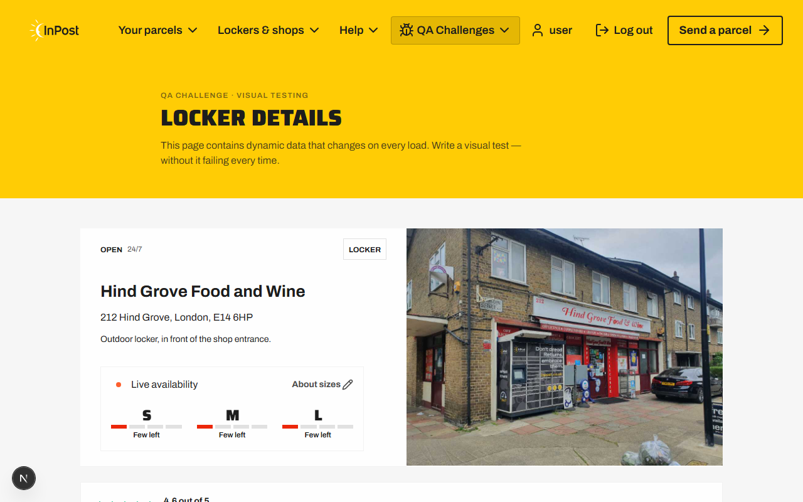

---

## Podsumowanie

| Priorytet | Liczba |
|-----------|--------|
| Critical  | 1      |
| High      | 4      |
| Medium    | 6      |
| Low       | 4      |
| Info      | 0      |
| **Suma**  | **15** |

### Najpoważniejsze błędy do natychmiastowej naprawy:
1. Login form ukryty na tabletach - blokuje logowanie dla dużej grupy użytkowników
2. Postcode search zawsze błąd 500 - kluczowa funkcja strony głównej nieczynna
3. Profil: biała strona dla niezalogowanych - brak redirect
4. Profil: „Invalid Date" - hardcoded błąd w kodzie produkcyjnym
5. /api/login: 500 zamiast 400 dla błędnego formatu emaila
