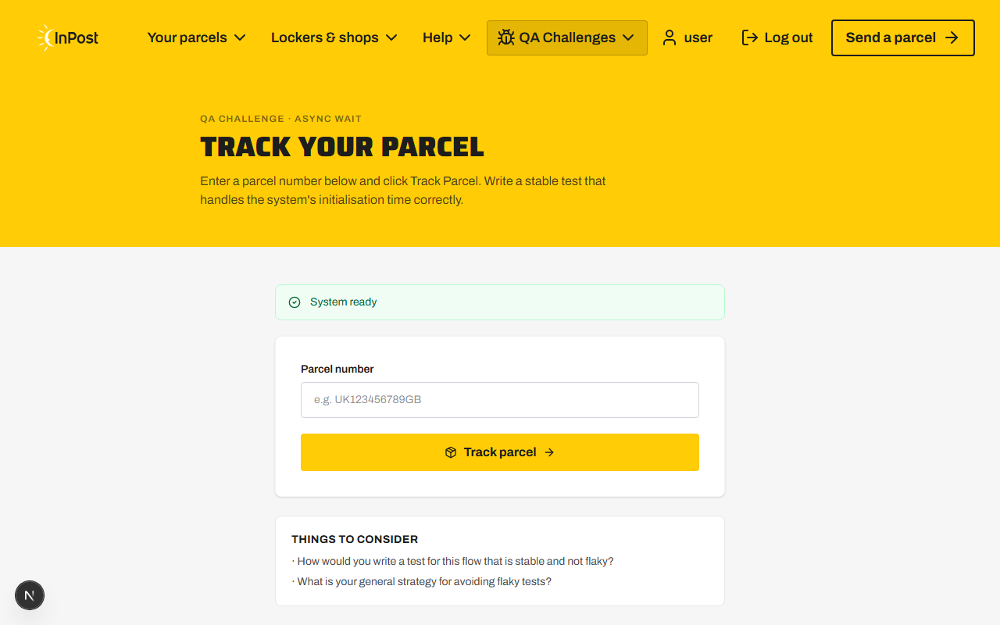

# Test Report — InPost QA Assignment

**Tester:** Mateusz Gałuszka  
**Date:** 2026-05-05  
**Environment:** http://localhost:3000 (Next.js 15, Node.js)  
**Browser:** Chromium 1280×800  

---

## Strona główna (/)

**[High]** Wyszukiwarka lokalizacji (postcode) zawsze zwraca błąd 500  
Opis: Każde zapytanie do `/api/postcode` zwraca HTTP 500 z komunikatem „Service temporarily unavailable. Please try again later." Endpoint jest niezaimplementowany — handler zwraca stały błąd bez logiki. Użytkownik nie może znaleźć żadnego lockera.  
Odtwarzanie: Wpisz dowolny kod pocztowy (np. `SW1A 1AA`) → kliknij przycisk strzałki → pojawia się komunikat błędu.  
Oczekiwany wynik: Lista lokalizacji InPost w pobliżu podanego kodu pocztowego.  

**[Medium]** Typo w sekcji hero: „avalible" zamiast „available"  
Opis: Tekst pod grafiką główną zawiera literówkę: „Over 4,000 parcel lockers **avalible** across the UK, 24/7". Błąd ortograficzny wpływa na wizerunek marki.  
Oczekiwany wynik: „Over 4,000 parcel lockers **available** across the UK, 24/7"  

**[Medium]** Karty CTA („Track a parcel", „Return in seconds", „Send a parcel") nie są klikalne  
Opis: Trzy karty mają klasę `cursor-pointer` i wyglądają jak interaktywne elementy, ale nie są ani linkami (`<a>`), ani przyciskami (`<button>`). Kliknięcie nie wywołuje żadnej akcji. Użytkownik może być zdezorientowany.  
Oczekiwany wynik: Karty prowadzą do odpowiednich sekcji lub stron (np. śledzenie paczki, zwroty, wysyłka).  

**[Medium]** Pole newsletter ma `type="text"` zamiast `type="email"`  
Opis: Input newslettera jest typu `text`, więc przeglądarka nie waliduje formatu email na poziomie HTML. Validacja po stronie JS jest zbyt słaba — akceptuje wartości jak `a@b` (jeden znak przed i po `@`).  
Oczekiwany wynik: `type="email"` i silniejsza walidacja (np. regex sprawdzający domenę z kropką).  

---

## Strona logowania (/login)

**[Critical]** Formularz logowania niewidoczny na ekranach średnich (768px–1023px)  
Opis: Kontener formularza ma klasy Tailwind `md:hidden lg:flex`, co ukrywa go w zakresie breakpointów md (768–1023px), czyli m.in. na tabletach i mniejszych laptopach. Strona wyświetla się jako biała i pusta — użytkownik nie może się zalogować.  
Odtwarzanie: Otwórz `/login` przy szerokości okna 900px.  
Oczekiwany wynik: Formularz widoczny na wszystkich rozmiarach ekranu.  

**[High]** Serwer zwraca HTTP 500 przy niepoprawnym formacie emaila  
Opis: Endpoint `/api/login` rzuca wyjątek (`throw new Error('Invalid email format')`) zamiast zwracać odpowiedź 400. Next.js przechwytuje niezłapany wyjątek i odpowiada błędem 500. Klient otrzymuje odpowiedź inną niż oczekiwana, co może skutkować błędem w UI.  
Odtwarzanie: `POST /api/login` z body `{ "email": "notanemail", "password": "anything" }`  
Oczekiwany wynik: HTTP 400 z JSON `{ "error": "Invalid email format" }`.  

**[Medium]** Link „Sign up here" to nieklikalny ``, nie link  
Opis: Tekst „Sign up here" pod formularzem jest renderowany jako ``, nie `<a>`. Kliknięcie nie powoduje żadnej akcji. Użytkownik może oczekiwać nawigacji do rejestracji.  
Oczekiwany wynik: `<a href="/register">Sign up here</a>` lub przycisk z obsługą nawigacji.  

**[Low]** Walidacja email w yup nie sprawdza formatu  
Opis: Schema yup: `email: yup.string().required('Email is required')` — brak `.email()` walidatora. Wartości jak `notanemail` lub `a b` przejdą walidację po stronie klienta.  
Oczekiwany wynik: `email: yup.string().email('Enter a valid email').required('Email is required')`  

**[Low]** Zbyt ogólny komunikat błędu po nieudanym logowaniu  
Opis: Po błędzie HTTP 401 (złe dane) UI wyświetla „Login failed. Please try again." — komunikat jest taki sam jak przy błędzie sieciowym. Brak informacji czy problem dotyczy emaila, hasła, czy połączenia.  
Oczekiwany wynik: „Invalid email or password. Please try again."  

---

## Strona profilu (/profile)

**[High]** Niezalogowany użytkownik widzi pustą stronę zamiast przekierowania  
Opis: Komponent `ProfilePage` zwraca `null` gdy `!user`, co powoduje renderowanie pustej białej strony. Brak przekierowania do `/login`. Użytkownik nie wie dlaczego strona jest pusta.  
Odtwarzanie: Wejdź na `http://localhost:3000/profile` bez wcześniejszego logowania.  
Oczekiwany wynik: Przekierowanie `router.push('/login')` z opcjonalnym parametrem `?redirect=/profile`.  

**[High]** Pole „Member Since" wyświetla „Invalid Date"  
Opis: Kod `new Date('asdasd').toString()` w `profile/page.tsx` (linia 88) produkuje string „Invalid Date". Jest to hardcoded błąd — zmienna `user.id` jest ustawiana jako `Date.now().toString()` przy logowaniu, ale funkcja `Number.parseInt(user.id)` jest już poprawna i zwróci timestamp. Jednak linia 88 ignoruje `joinDate` i zamiast tego ewaluuje statyczną wartość.  
Odtwarzanie: Zaloguj się, wejdź na `/profile` → sekcja „Member Since" pokazuje „Invalid Date".  
Oczekiwany wynik: Sekcja „Member Since" powinna używać zmiennej `joinDate` (zdefiniowanej na linii 27) zamiast `new Date('asdasd').toString()`.  

**[Medium]** Nazwa użytkownika oparta na prefiksie emaila (bez kapitalizacji właściwej)  
Opis: Użytkownik `user@example.com` widzi imię `user` (przed `@`). Klasa CSS `capitalize` jedynie kapitalizuje pierwszą literę, ale użytkownicy z emailami jak `jan.kowalski@...` zobaczą `jan.kowalski` jako imię. To nie jest prawdziwe imię.  
Oczekiwany wynik: Formularz rejestracji/logowania powinien zawierać pole na imię i nazwisko. Lub `user.name` powinien być ustawiony na wartość „Unknown User" jeśli nie ma prawdziwego imienia.  

---

## Znalezione poza stronami testowanymi

Poniższe błędy zostały znalezione podczas eksploracji aplikacji poza głównymi stronami (/ , /login , /profile).

## Strona async (/challenges/async)

**[Medium]** Formularz możliwy do wysłania zanim `systemReadyRef` jest ustawiony, mimo że UI pokazuje „System ready"  
Opis: UI ustawia systemStatus na `'ready'` po 3 sekundach (timer), ale `systemReadyRef.current` ustawiany jest dopiero gdy `/api/parcel-ready` odpowie (5 sekund). Między 3 a 5 sekundą po załadowaniu strony UI wskazuje „System ready" ale wysłanie formularza daje błąd „Tracking system is still initialising". To mylące doświadczenie dla użytkownika.  
Odtwarzanie: Załaduj stronę → poczekaj dokładnie 3 sekundy → wyślij formularz → błąd mimo wskaźnika „System ready".  
Oczekiwany wynik: Timer UI powinien być zsynchronizowany z faktyczną gotowością API, albo oba warunki powinny być sprawdzane łącznie.  

**[Low]** Pole parcel number nie ma przycisku czyszczenia i brak walidacji przy pustym polu  
Opis: Wysłanie pustego pola parcel number powoduje zapytanie do API z `parcelNumber: ""` — API zwraca 400. Brak walidacji po stronie frontendu.  
Oczekiwany wynik: Walidacja pola przed wysłaniem — komunikat „Please enter a parcel number".  

---

## Strona visual (/challenges/visual)

**[Low]** Brak atrybutu `alt` na zdjęciu lockera  
Opis: `` — brak `alt`. Narusza WCAG 2.1.  
Oczekiwany wynik: `alt={locker.locationName}` lub odpowiedni opis.  

---

## Dokumentacja API (/challenges/api-testing)

**[Medium]** GET /api/parcels nie wymaga autoryzacji — dane wszystkich paczek są publiczne  
Opis: Endpoint `GET /api/parcels` zwraca listę wszystkich paczek bez nagłówka Authorization. Inne metody (POST, DELETE na `/api/parcels`) i operacje na konkretnych paczkach wymagają tokenu, ale `GET` jest publiczny. Może to prowadzić do wycieku danych.  
Odtwarzanie: `curl http://localhost:3000/api/parcels` — zwraca listę paczek bez tokenu.  
Oczekiwany wynik: GET powinien również wymagać autoryzacji (lub udostępniać tylko własne paczki użytkownika).  

**[Medium]** DELETE /api/parcels nie wymaga autoryzacji — resetuje cały magazyn  
Opis: `DELETE /api/parcels` usuwa wszystkie paczki bez żadnego tokenu autoryzacyjnego. Może prowadzić do masowego usunięcia danych przez nieuprawnionego użytkownika.  
Odtwarzanie: `curl -X DELETE http://localhost:3000/api/parcels` — usuwa wszystkie paczki.  
Oczekiwany wynik: Endpoint powinien wymagać autoryzacji lub być niedostępny publicznie.  

---

## Błędy w konsoli przeglądarki

**[Medium]** Console error: React `key` prop przy renderowaniu listy  
Opis: Komponent dostępności przedziałów (`CompartmentAvailability`) używa `index` jako klucza dla kolorów pasków. Nie jest to krytyczny błąd, ale suboptymalna praktyka.

**[Info]** Brak Content-Security-Policy header  
Opis: Żaden z response headers nie zawiera CSP. Strona jest podatna na potencjalne ataki XSS.  

---

## Podsumowanie

| Priorytet | Liczba |
|-----------|--------|
| Critical  | 1      |
| High      | 4      |
| Medium    | 8      |
| Low       | 5      |
| Info      | 2      |
| **Suma**  | **20** |

### Najpoważniejsze błędy do natychmiastowej naprawy:
1. Login form ukryty na tabletach — blokuje logowanie dla dużej grupy użytkowników
2. Postcode search zawsze błąd 500 — kluczowa funkcja strony głównej nieczynna
3. Profil: biała strona dla niezalogowanych — brak redirect
4. Profil: „Invalid Date" — hardcoded błąd w kodzie produkcyjnym
5. /api/login: 500 zamiast 400 dla błędnego formatu emaila
